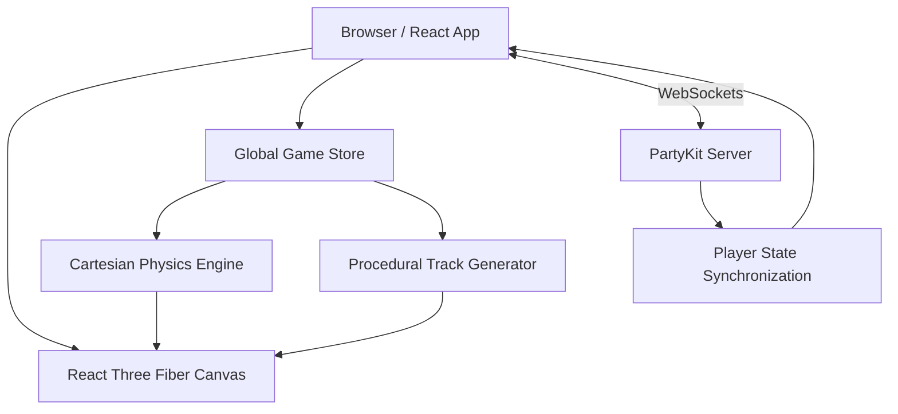

# System Architecture

## High-Level Data Flow

## State Synchronization
The application relies on **PartyKit** for low-latency, real-time multiplayer networking. 
- The server (`party/server.ts`) acts as a highly optimized state relay, utilizing Edge compute for proximity to clients.
- Player positions, rotations, and metadata are synchronized using lightweight JSON payloads over WebSockets.
- The `partysocket` client integration ensures rapid reconnection and state reconciliation.

## Memory Management
To maintain high performance and avoid garbage collection (GC) micro-stutters during 60+ FPS gameplay:
- **Object Pooling**: Avoided rapid instantiation of Three.js `Vector3`, `Quaternion`, and `Matrix4` objects in the core render loop. Pre-allocated global vectors are reused for frame-by-frame physics calculations.
- **Geometry Lifecycle Management**: Procedurally generated track geometries (`ShapeGeometry`, `ExtrudeGeometry`) are calculated once, cached, and explicitly disposed of (`geometry.dispose()`) when track segments are regenerated.

## Custom Cartesian Physics
The standard physics wrappers were replaced with a bespoke **Cartesian free-roaming model** to accurately handle non-planar track geometries (e.g., loops, 90-degree vertical banks).
- **Surface Normal Alignment**: Car pitch and roll are explicitly aligned to the track's surface normal using exact plane intersection mathematics.
- **Frenet Frames**: Fixed UP vectors and manual Frenet Frame calculations ensure reliable 3D orientation without gimbal lock, crucial for navigating complex curves.
- **Interpolation & Smoothing**: Added bezier smoothing to track loop seams and integrated smooth interpolation for rigid body transitions.

## Security & Input Validation
- **State Authority Framework**: While currently optimized as a rapid state relay, the PartyKit server structure (`server.ts`) is designed to easily accommodate authoritative server-side checks.
- **Headless Validation**: The repository employs automated headless scripts (`test_frames.js`, `test_frames.cjs`, `validate_track.ts`) to validate 3D orientations and track integrity outside of the browser context. This guarantees that physics updates and track generation parameters do not introduce clipping or un-navigable geometries before runtime.

## Performance Scaling
- **Dynamic Frustum Culling**: Extraneous objects like support pillars and distant track segments are aggressively culled to save draw calls.
- **Resolution Scaling**: Track geometry sample resolution scales dynamically based on complexity, balancing visual fidelity with strict polygon-count limits for lower-end hardware.
